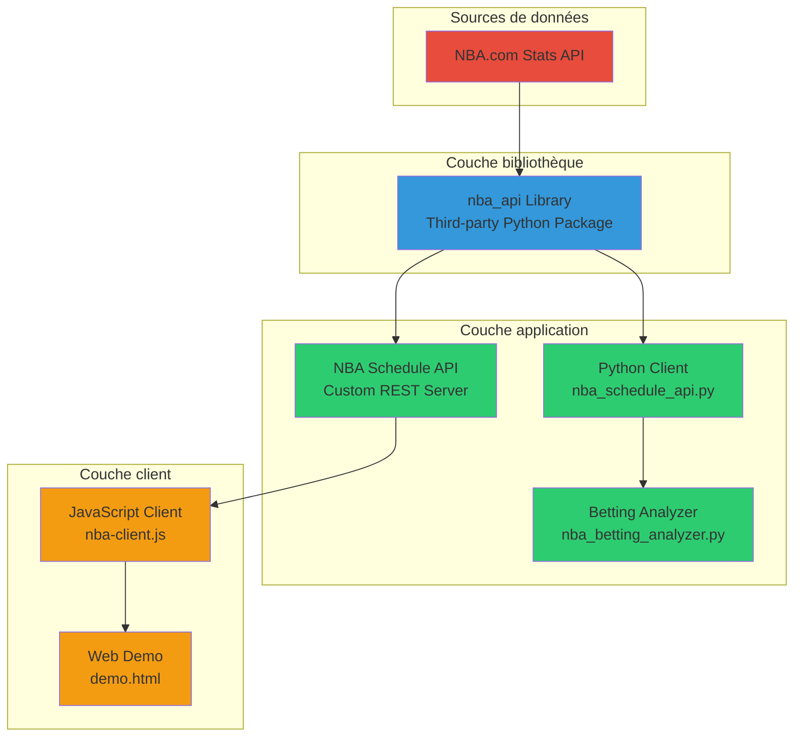

# 🏀 Stat Discute - NBA Statistics Platform

> **Mission:** Proposer l'outil de statistiques sportives dédié aux paris sportifs le plus complet et efficace possible

Une plateforme complète pour accéder aux statistiques NBA via des APIs REST, des clients Python/JavaScript, et des outils d'analyse pour les paris sportifs.

---

## 📋 Table des matières

1. [Vue d'ensemble](#-vue-densemble)
2. [Architecture du projet](#-architecture-du-projet)
3. [Navigation rapide](#-navigation-rapide)
4. [Démarrage rapide](#-démarrage-rapide)
5. [Guide linguistique](#-guide-linguistique)
6. [Composants du projet](#-composants-du-projet)
7. [Technologies utilisées](#-technologies-utilisées)
8. [Contribution](#-contribution)
9. [Licence](#-licence)

---

## 🎯 Vue d'ensemble

**Stat Discute** est une plateforme de statistiques NBA composée de deux composants principaux :

1. **NBA Schedule API** (Custom) - API REST locale pour calendriers et analyses
2. **nba_api Library** (Third-party) - Bibliothèque Python pour accès direct à NBA.com

### Cas d'usage principaux

- ✅ **Développeurs web** : Intégration API REST pour applications de statistiques
- ✅ **Analystes de paris sportifs** : Outils de prédiction et d'analyse de performance
- ✅ **Data scientists** : Accès direct aux données NBA via Python
- ✅ **Développeurs frontend** : Client JavaScript avec cache intelligent

---

## 🏗️ Architecture du projet



### Flux de données

1. **NBA.com API** → Fournit les données officielles NBA
2. **nba_api Library** → Encapsule l'accès à NBA.com avec interface Python
3. **NBA Schedule API** → Serveur REST Flask exposant endpoints personnalisés
4. **Clients** → Python direct ou JavaScript via HTTP pour applications finales

### Composants et responsabilités

| Composant | Type | Responsabilité | Langage |
|-----------|------|----------------|---------|
| NBA.com Stats API | Externe | Source de données officielle | N/A |
| nba_api | Third-party | Bibliothèque d'accès NBA.com | Python |
| NBA Schedule API | Local | Serveur REST personnalisé | Python + Flask |
| Python Client | Local | Scripts et analyses | Python |
| JavaScript Client | Local | Intégration web | JavaScript |
| Betting Analyzer | Local | Prédictions paris sportifs | Python |

---

## 🧭 Navigation rapide

### Choix du composant selon votre besoin

**Je veux...**

- **Créer une application web avec stats NBA** → [NBA Schedule API](./nba-schedule-api/README.md)
  - API REST prête à l'emploi
  - Client JavaScript fourni
  - Cache intelligent
  - Documentation en français

- **Analyser des données NBA avec Python** → [nba_api Library](./nba_api/README.md)
  - Accès direct aux endpoints NBA.com
  - 100+ endpoints documentés
  - Support Pandas DataFrames
  - Documentation en anglais

- **Démarrer rapidement (API REST)** → [Quick Start Guide](./nba-schedule-api/QUICK_START.md)
  - Installation en 3 étapes
  - Exemples de code
  - Troubleshooting

- **Développer avec Claude Code** → [CLAUDE.md](./nba-schedule-api/CLAUDE.md)
  - Guide d'intégration IA
  - Conventions du projet
  - Structures de données

### Documentation par type

| Type | Fichier | Description |
|------|---------|-------------|
| **API Reference** | [nba-schedule-api/README.md](./nba-schedule-api/README.md) | Endpoints, paramètres, exemples |
| **Library Docs** | [nba_api/README.md](./nba_api/README.md) | Bibliothèque Python nba_api |
| **Quick Start** | [nba-schedule-api/QUICK_START.md](./nba-schedule-api/QUICK_START.md) | Démarrage en 5 minutes |
| **Contributing** | [nba_api/CONTRIBUTING.md](./nba_api/CONTRIBUTING.md) | Guide de contribution |
| **Changelog** | [nba_api/CHANGELOG.MD](./nba_api/CHANGELOG.MD) | Historique des versions |
| **Endpoint Specs** | [nba_api/docs/nba_api/stats/endpoints/](./nba_api/docs/nba_api/stats/endpoints/) | 100+ endpoints NBA.com |

---

## 🚀 Démarrage rapide

### Prérequis

- Python 3.7+
- pip (gestionnaire de packages Python)
- Navigateur web moderne (pour la démo)

### Installation (3 étapes)

#### 1️⃣ Cloner le projet

```bash
git clone <repository-url>
cd stat-discute.be
```

#### 2️⃣ Installer les dépendances

**Option A : Environnement virtuel (recommandé)**
```bash
python3 -m venv venv
source venv/bin/activate  # macOS/Linux
# ou: venv\Scripts\activate  # Windows
pip install -r nba-schedule-api/requirements.txt
```

**Option B : Installation système**
```bash
pip install -r nba-schedule-api/requirements.txt --break-system-packages
```

#### 3️⃣ Démarrer le serveur API

```bash
cd nba-schedule-api
python nba_api_server.py
```

Le serveur démarre sur **http://localhost:5000**

### Vérifier l'installation

**Tester l'API :**
```bash
curl http://localhost:5000/api/nba/health
```

**Réponse attendue :**
```json
{
  "success": true,
  "message": "NBA Schedule API is running",
  "version": "1.0.0",
  "current_season": "2024-25"
}
```

**Démo web :**
Ouvrez `nba-schedule-api/demo.html` dans votre navigateur.

---

## 🌍 Guide linguistique

### Stratégie documentaire

Ce projet utilise une approche bilingue **français/anglais** selon le public cible :

#### Documentation en français 🇫🇷

**Où :** `nba-schedule-api/`

**Pourquoi :**
- Cible principale : développeurs francophones
- Contexte : paris sportifs (marché francophone)
- Mission : outils pour analystes français/belges/canadiens

**Fichiers concernés :**
- `nba-schedule-api/README.md` - Documentation API complète
- `nba-schedule-api/QUICK_START.md` - Guide de démarrage
- Commentaires dans `nba_schedule_api.py`, `nba_betting_analyzer.py`

#### Documentation en anglais 🇬🇧

**Où :** `nba_api/`, `nba-schedule-api/CLAUDE.md`

**Pourquoi :**
- Bibliothèque internationale (nba_api)
- Contribution open-source mondiale
- Intégration avec outils IA (Claude Code)

**Fichiers concernés :**
- `nba_api/README.md` - Bibliothèque nba_api
- `nba_api/CONTRIBUTING.md` - Guide de contribution
- `nba_api/docs/` - Documentation endpoints (100+ fichiers)
- `nba-schedule-api/CLAUDE.md` - Guide IA

### Comment choisir ?

| Situation | Langue | Raison |
|-----------|--------|--------|
| Utilisation de l'API REST | 🇫🇷 Français | Documentation locale |
| Contribution à nba_api | 🇬🇧 Anglais | Communauté internationale |
| Analyse de paris sportifs | 🇫🇷 Français | Contexte métier |
| Développement avec Claude | 🇬🇧 Anglais | Standard IA |
| Questions/Issues GitHub | 🇫🇷 ou 🇬🇧 | Selon le composant |

### Plan de traduction

**Objectif :** 80% de couverture bilingue pour documentation critique

**Priorités :**
- [x] README principal (ce fichier) - Bilingue
- [ ] QUICK_START.md - Traduction EN en cours
- [ ] Architecture docs - Bilingue
- [ ] Deployment guide - À créer (bilingue)
- [ ] Security docs - À créer (bilingue)

---

## 📦 Composants du projet

### 1. NBA Schedule API (Local)

**Localisation :** `./nba-schedule-api/`

**Description :** API REST personnalisée pour calendriers NBA et analyses de paris sportifs.

**Fichiers principaux :**
- `nba_api_server.py` - Serveur Flask REST
- `nba_schedule_api.py` - Client Python
- `nba_betting_analyzer.py` - Outils d'analyse paris
- `nba-client.js` - Client JavaScript
- `demo.html` - Interface de démonstration

**Fonctionnalités :**
- ✅ Calendrier complet NBA/WNBA
- ✅ Scores en temps réel
- ✅ Statistiques par équipe
- ✅ Prédictions over/under et vainqueur
- ✅ Cache intelligent (5 minutes)
- ✅ Intégration Chart.js

**Documentation :** [README complet](./nba-schedule-api/README.md)

### 2. nba_api Library (Third-party)

**Localisation :** `./nba_api/`

**Description :** Bibliothèque Python officieuse pour accès NBA.com Stats API.

**Origine :** [swar/nba_api](https://github.com/swar/nba_api)

**Fonctionnalités :**
- ✅ 100+ endpoints NBA.com documentés
- ✅ Support Pandas DataFrames
- ✅ Données live et historiques
- ✅ Endpoints Stats et Live
- ✅ Documentation exhaustive

**Installation :**
```bash
pip install nba_api
```

**Exemple d'utilisation :**
```python
from nba_api.stats.endpoints import playercareerstats

# Nikola Jokić
career = playercareerstats.PlayerCareerStats(player_id='203999')
df = career.get_data_frames()[0]
print(df)
```

**Documentation :** [README nba_api](./nba_api/README.md)

---

## 🛠️ Technologies utilisées

### Backend

| Technologie | Version | Usage |
|-------------|---------|-------|
| Python | 3.7+ | Langage principal |
| Flask | 3.0.0+ | Serveur REST |
| nba_api | 1.4.1 | Accès NBA.com |
| pandas | 2.0.0+ | Traitement données |
| numpy | 1.24.0+ | Calculs numériques |

### Frontend

| Technologie | Usage |
|-------------|-------|
| JavaScript ES6 | Client API |
| Chart.js | Visualisations |
| HTML5/CSS3 | Interface démo |

### Infrastructure

| Outil | Usage |
|-------|-------|
| Flask-CORS | Support CORS |
| Requests | HTTP client |
| Poetry | Gestion dépendances (nba_api) |
| pytest | Tests unitaires |

---

## 🤝 Contribution

### Pour NBA Schedule API (Local)

**Processus :**
1. Fork le projet
2. Créer une branche (`git checkout -b feature/ma-fonctionnalite`)
3. Commit (`git commit -m 'feat: ajouter fonctionnalité'`)
4. Push (`git push origin feature/ma-fonctionnalite`)
5. Ouvrir une Pull Request

**Standards :**
- Code style : PEP 8 (Python), StandardJS (JavaScript)
- Commits : Messages clairs et descriptifs
- Tests : Ajouter tests pour nouvelles fonctionnalités
- Documentation : Mettre à jour README si nécessaire

### Pour nba_api Library

**Suivre :** [nba_api/CONTRIBUTING.md](./nba_api/CONTRIBUTING.md)

**Points clés :**
- Conventional Commits obligatoire
- Poetry pour gestion dépendances
- Tests pytest requis
- Documentation endpoints pour nouveaux endpoints

---

## 📞 Support et contact

### Questions et aide

- **Slack nba_api** : [Rejoindre](https://join.slack.com/t/nbaapi/shared_invite/zt-3dc2qtnh0-udQJoSYrQVWaXOF3owVaAw)
- **Stack Overflow** : Tag `nba-api`
- **GitHub Issues** : [Créer une issue](https://github.com/swar/nba_api/issues)

### Documentation complémentaire

- **Guide de démarrage** : [QUICK_START.md](./nba-schedule-api/QUICK_START.md)
- **Guide Claude Code** : [CLAUDE.md](./nba-schedule-api/CLAUDE.md)
- **Exemples Jupyter** : [docs/examples/](./nba_api/docs/examples/)

### Ressources externes

- [NBA.com Stats](https://stats.nba.com) - API source
- [nba_api GitHub](https://github.com/swar/nba_api) - Projet upstream
- [Chart.js Docs](https://www.chartjs.org/docs/) - Documentation visualisations
- [Flask Docs](https://flask.palletsprojects.com/) - Documentation Flask

---

## 📄 Licence

### NBA Schedule API (Local)

**Licence :** À définir

**Restrictions :**
- Respecter les [Terms of Use NBA.com](https://www.nba.com/termsofuse)
- Usage commercial : vérifier conformité avec NBA.com
- Attribution requise pour usage public

### nba_api Library

**Licence :** [MIT License](./nba_api/LICENSE)

**Projet upstream :** [swar/nba_api](https://github.com/swar/nba_api)

---

## 📊 État du projet

### Version actuelle

- **NBA Schedule API :** v1.0.0 (inferred)
- **nba_api Library :** v1.4.1

### Statut des fonctionnalités

| Fonctionnalité | Statut | Notes |
|----------------|--------|-------|
| API REST | ✅ Stable | Production-ready |
| Client JavaScript | ✅ Stable | Cache intelligent |
| Client Python | ✅ Stable | Exemples complets |
| Betting Analyzer | ✅ Stable | Prédictions fonctionnelles |
| Documentation | 🟡 En cours | Amélioration continue |
| Tests | 🟡 Partiel | Coverage à améliorer |
| Déploiement prod | 🔴 Non documenté | À créer |

**Légende :** ✅ Complet | 🟡 En cours | 🔴 À faire

### Roadmap

**Court terme (1 mois) :**
- [ ] Documentation déploiement production
- [ ] Guide de tests complet
- [ ] Documentation sécurité
- [ ] API versioning strategy

**Moyen terme (3 mois) :**
- [ ] Traduction documentation EN/FR complète
- [ ] Diagrammes architecture détaillés
- [ ] Optimisation performance
- [ ] Monitoring et logs

**Long terme (6+ mois) :**
- [ ] Support multi-sports (WNBA, G-League)
- [ ] Interface web complète
- [ ] API GraphQL
- [ ] Machine learning predictions

---

## 🙏 Remerciements

- **nba_api maintainers** - Pour la bibliothèque Python exceptionnelle
- **NBA.com** - Pour l'API Stats publique
- **Communauté open-source** - Pour les outils et frameworks utilisés

---

## 📝 Notes de version

**v1.0.0** (2024-10-23)
- Release initiale NBA Schedule API
- Intégration nba_api v1.4.1
- Documentation complète en français
- Démo web interactive
- Outils d'analyse paris sportifs

---

**Dernière mise à jour :** 2024-10-23
**Mainteneur :** Stat Discute Team
**Documentation :** Ce fichier est mis à jour régulièrement - voir git log pour historique
